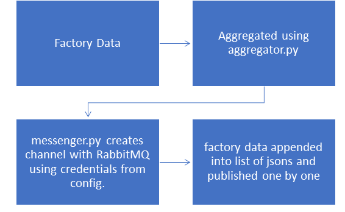
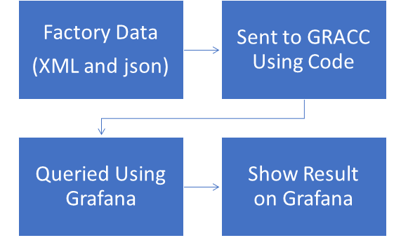

### Overview

Factory Data online (completed data from json and schedd status from xml) is aggregated using
aggregator.py

The URL of the factory data looks like:

http://factory_name@host_url/factory/monitor/schedd_status.xml
http://factory_name@host_url/factory/monitor/completed_data.json

monitor.py (set on cron for 5m) calls aggregator.py. 
Subsequently messenger.py creates exchange on pika using credentials in Rabbitmq_osg.json pushes
the jsons one by one to Elasticsearch.

Data is pulled from GRACC into Grafana. The Dashboard json is included in the repo.

Curator on GRACC is set to delete data every 12 months.

### Prerequisites

Make sure a java VM is installed. Elasticsearch needs at least java 8.
Instructions to install Elasticsearch and other packages are in Installation.md in the master branch

### Architecture

The main architecture is showcased in the flowchart:

### Config

There are 2 main config files,

  Config.json takes the factory data, namely the 
    completed_url 
    schedd_url
    
  Rabbit_osg.json contains the credentials for pushing data to RabbitMQ mainly,
    host
    vhost
    username
    password
    queue
    exchange
    key

